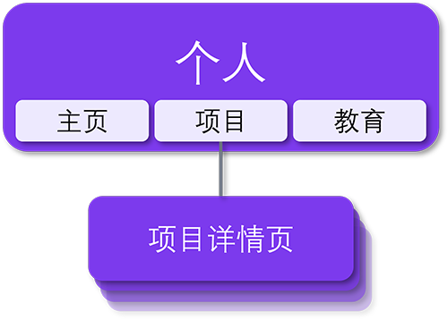

# [isarvin.com](https://isarvin.com)

[English](./README.md) | **简体中文**

还是青涩的高中生时，我第一次接触到了使用C++去尝试解决一些问题。这也无疑是我第一次进入到编程语言的世界。上了大学后，我开始学习软件开发。嗐，那时候一天天yy自己将来成为最nb的全栈开发 ~~（不过显然我是摸鱼小能手）~~。当我对HTML ~~（How to Meet Ladies：如何偶遇漂亮小姐姐）~~ 和Bootstrap从入门到~~放弃~~精通时，我还想过要做一套家喻户晓的养眼的界面套件。如今，作为一个抱大腿的调包开发者，终于在鱼都摸烂了后用Vue.js 3和[Tailwind CSS](https://tailwindcss.com/)建了个人网站。所以这就是Arvin（俺的英文名）。😉

网站部署在[Vercel](https://vercel.com/home)上。网站的设计遵循以下主要原则。

- 响应式布局。
- 统一设计语言。
- 支持深色模式。
- 无障碍：支持减少动画。

网站内容结构如下图。请注意此项目使用[GPL-3.0协议](./LICENSE)。

## 注意

1. 截至2021年8月27日，使用Visual Studio Code（版本：1.59.1）、Node.js 16.4.2和Vue CLI 5.0.0-beta.3开发表现良好。此外，我要特别感谢Tailwind提供的[丰富、可扩展的CSS框架和资源](https://tailwindcss.com/resources)，这节省了许多开发时间。
2. 项目主要依赖参见下面的表格。

    | 名称 | 版本 |
    | :-- | :--: |
    | @headlessui/vue | 1.4.0 |
    | @heroicons/vue | 1.0.4 |
    | [smoothscroll-polyfill](https://github.com/iamdustan/smoothscroll) | 0.4.4 |
    | tailwindcss | 2.2.7 |
    | vue | 3.2.4 |
    | vue-meta | 3.0.0-alpha.9 |
    | vue-router | 4.0.11 |
