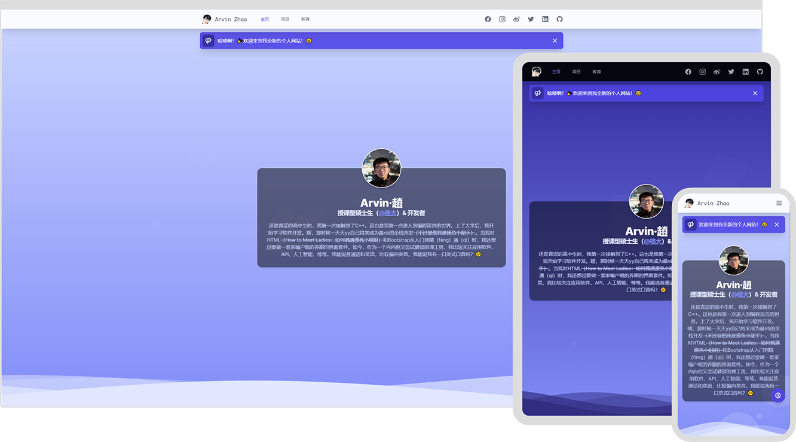
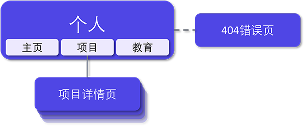

# [isarvin.com](https://isarvin.com)

[](https://www.codacy.com/gh/ArvinZJC/isarvin/dashboard?utm_source=github.com&utm_medium=referral&utm_content=ArvinZJC/isarvin&utm_campaign=Badge_Grade)
[](https://isarvin.com)


[English](./README.md) | **简体中文**

> 个人网站的创建让我更了解自己了，所以这就是 Arvin。😉

Arvin 是俺的英文名，作为一个抱大腿的调包开发者，终于在鱼都摸烂了后用 Vue.js 3 和 [Tailwind CSS](https://tailwindcss.com/) 建了此个人网站。网站部署在 [Vercel](https://vercel.com/home) 上。网站的设计遵循以下主要原则。

- 响应式布局。
- 统一设计语言。
- 支持深色模式。
- 国际化: English / 简体中文。
- 无障碍：支持减少动画。



网站内容结构如下图。



## ❗ 注意

> 敲黑板了！敲黑板了！🔥

1. 此项目使用 [GPL-3.0 协议](./LICENSE)。截至 2022 年 3 月 12 日，使用 Visual Studio Code（版本：1.65.2）、Node.js 16.13.2 和 Vue CLI 5.0.1 开发表现良好。此外，我要特别感谢 Tailwind 提供的[丰富、可扩展的 CSS 框架和资源](https://tailwindcss.com/resources)，这节省了许多开发时间。
2. 受 [Tailwind CSS 的影响](https://tailwindcss.com/docs/browser-support)，网站能支持**大多数主流浏览器的最新稳定版**。

   > Tailwind CSS v3.0 主要是为在 Chrome、Firefox、Edge 和 Safari 的最新稳定版上有良好的表现而设计并测试的。任何版本 IE（包括 IE 11）都不受支持。

3. 项目主要依赖参见下面的表格。更多信息请参见 [`package.json`](./package.json)。

   | 名称                     |     版本      |
   | :----------------------- | :-----------: |
   | @headlessui/vue          |     1.5.0     |
   | @heroicons/vue           |     1.0.6     |
   | @intlify/vue-i18n-loader |     4.1.0     |
   | autoprefixer             |    10.4.2     |
   | postcss                  |     8.4.8     |
   | smoothscroll-polyfill    |     0.4.4     |
   | tailwindcss              |    3.0.23     |
   | vue                      |    3.2.31     |
   | vue-cli-plugin-i18n      |     2.3.1     |
   | vue-i18n                 |     9.1.9     |
   | vue-meta                 | 3.0.0-alpha.9 |
   | vue-router               |    4.0.14     |

4. 您可以在项目根目录下手动创建名为 `.env` 或 `.env.local` 的文件，并包含如下内容。请注意这个操作 _可选_。**在没有这个文件的情况下，此项目应仍能良好运行**。

   ```sh
   VUE_APP_I18N_FALLBACK_LOCALE=en
   ```

5. Vue CLI 确实不是 Vue.js 3 项目中必不可少的，不过它还是对此项目的开发过程有点好处的。在项目根目录下，按如下步骤使用 npm 的命令可以在本地运行此项目。

   - 安装项目所需依赖。

     ```sh
     npm install -g @vue/cli serve  # @vue/cli 可选。
     npm install
     ```

   - _（可选）_ 报告丢失的或未使用的多语言信息。请注意这是 [vue-cli-plugin-i18n 的实验功能](https://github.com/intlify/vue-cli-plugin-i18n#-features)。对于此项目，您可以忽略这个功能的输出。

     ```sh
     npm run i18n:report
     # 或
     npx vue-cli-service i18n:report --src "./src/**/*.?(js|vue)" --locales "./src/locales/**/*.json"
     ```

   - 调试与构建。

     - 若调试项目（开发环境），则：

       ```sh
       npm run serve
       # 或
       npx vue-cli-service serve
       ```

     - 若构建项目（生产环境），则：

       ```sh
       npm run build
       # 或
       npx vue-cli-service build

       serve -s dist
       ```

     - _（推荐）_ 若使用 Visual Studio Code 的运行和调试面板, 则需要将下面内容添加至 `.vscode/launch.json` 来配置此项目的调试与构建过程。

       ```JSON
       {
         "configurations": [
           {
             "name": "vue: dev",
             "request": "launch",
             "runtimeArgs": ["run", "serve"],
             "runtimeExecutable": "npm",
             "skipFiles": ["<node_internals>/**"],
             "type": "node"
           },
           {
             "name": "vue: production",
             "request": "launch",
             "runtimeArgs": ["run", "build"],
             "runtimeExecutable": "npm",
             "skipFiles": ["<node_internals>/**"],
             "type": "node"
           }
         ]
       }
       ```

好运哦! 💖
