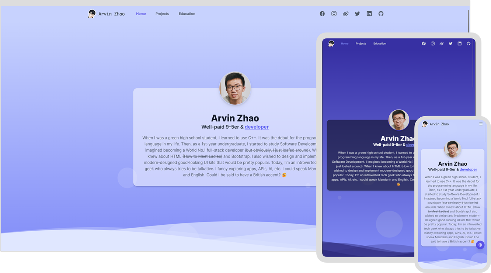

# [isarvin.com](https://isarvin.com)

[](https://www.codacy.com/gh/ArvinZJC/isarvin/dashboard?utm_source=github.com&utm_medium=referral&utm_content=ArvinZJC/isarvin&utm_campaign=Badge_Grade)
[](https://isarvin.com)

[](./LICENCE)

**English (United Kingdom)** | [中文（简体，中国）](./README_zh-Hans-CN.md)

> I came to know myself better when I started to build my personal site. So this is Arvin. 😉

Arvin is my English name. I am an incompetent developer finally building the personal site with Vue.js 3 and [Tailwind CSS](https://tailwindcss.com/). The site is deployed on [Vercel](https://vercel.com/home). It is designed with the following primary principles.

<details>
  <summary>Click to expand/collapse</summary>

- Accessibility: reduced motion when required.
- Dark mode support.
- I18n (Internationalisation). Supported languages as follows:
  - English (United Kingdom)
  - English (United States) - default if no matches
  - 中文（简体，中国）
- Performance: debouncing, throttling, etc.
- Responsive design.
- Unified styles.

</details>



## ❗ ATTENTION

> May I have your attention pls? 🔥

1. By 13 September 2022, everything looks good with Visual Studio Code (Version: 1.71.0) + Node.js 16.16.0 + Vite 3.1.0. Additionally, I would like to thankfully acknowledge Tailwind for [its rich and extensible CSS framework and resources](https://tailwindcss.com/resources), which save much development time.
2. Due to [the use of Tailwind CSS](https://tailwindcss.com/docs/browser-support), the site could support **the latest stable versions of most popular modern browsers**.

   > In general, Tailwind CSS v3.0 is designed for and tested on the latest stable versions of Chrome, Firefox, Edge, and Safari. It does not support any version of IE, including IE 11.

3. The primary dependencies of the project are listed in the following table. For more info, please refer to [`package.json`](./package.json).

   | Name                          |    Version     |
   | :---------------------------- | :------------: |
   | @headlessui/vue               |     1.7.0      |
   | @heroicons/vue                |     2.0.10     |
   | @intlify/vite-plugin-vue-i18n |     6.0.1      |
   | autoprefixer                  |     10.4.9     |
   | postcss                       |     8.4.16     |
   | smoothscroll-polyfill         |     0.4.4      |
   | tailwindcss                   |     3.1.8      |
   | vue                           |     3.2.39     |
   | vue-i18n                      |     9.2.2      |
   | vue-meta                      | 3.0.0-alpha.10 |
   | vue-router                    |     4.1.5      |

4. Assuming the terminal is opened in the project's root directory, the project could be run locally following the steps below using npm.

   - Install all the required dependencies.

     ```sh
     npm ci
     ```

   - Serve/Build the project.

     - To serve it for development,

       ```sh
       npm run dev
       # OR
       npx vite --host
       ```

     - To build it for production,

       ```sh
       npm run build
       # OR
       npx vite build

       npm run preview
       # OR
       npx vite preview --host --port 5050
       ```

     - _(Recommended)_ If you fancy using the Run and Debug view of Visual Studio Code, you could add the following to `.vscode/launch.json` to configure the serving and building process.

       ```JSON
       {
         "configurations": [
           {
             "name": "Dev",
             "request": "launch",
             "runtimeArgs": ["run", "dev"],
             "runtimeExecutable": "npm",
             "skipFiles": ["<node_internals>/**"],
             "type": "node"
           },
           {
             "name": "Build",
             "request": "launch",
             "runtimeArgs": ["run", "build"],
             "runtimeExecutable": "npm",
             "skipFiles": ["<node_internals>/**"],
             "type": "node"
           },
           {
             "name": "Preview",
             "request": "launch",
             "runtimeArgs": ["run", "preview"],
             "runtimeExecutable": "npm",
             "skipFiles": ["<node_internals>/**"],
             "type": "node"
           }
         ]
       }
       ```

Good luck! 💖
