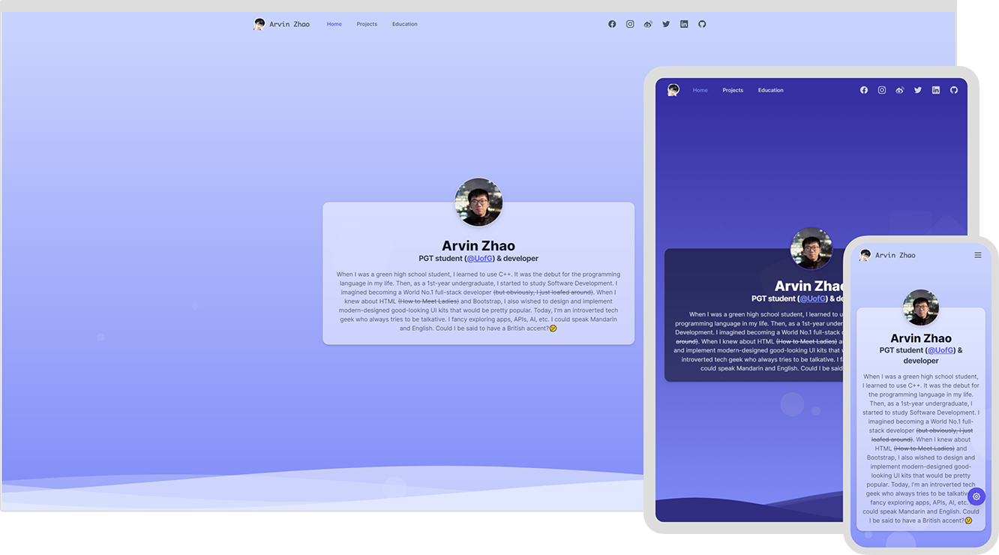
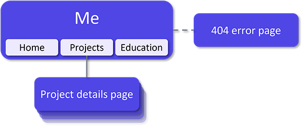

# [isarvin.com](https://isarvin.com)

[](https://isarvin.com)
[](https://www.codacy.com/gh/ArvinZJC/isarvin/dashboard?utm_source=github.com&amp;utm_medium=referral&amp;utm_content=ArvinZJC/isarvin&amp;utm_campaign=Badge_Grade)


**English** | [简体中文](./README-zhCN.md)

> I came to know myself better when I started to build my personal site. So this is Arvin. 😉

Arvin is my English name. I am an incompetent developer finally building the personal site with Vue.js 3 and [Tailwind CSS](https://tailwindcss.com/). The site is deployed on [Vercel](https://vercel.com/home). It is designed with the following primary principles.

- Responsive design.
- Unified styles.
- Dark mode support.
- I18n (Internationalisation): English / 简体中文.
- Accessibility: reduced motion when required.



The structure of the site is as follows. Please note that the code is licensed under [the GPL-3.0 License](./LICENSE).



## ❗ ATTENTION

> May I have your attention pls? 🔥

1. By 20 October 2021, everything looks good with Visual Studio Code (Version: 1.61.2) + Node.js 17.0.0 + Vue CLI 5.0.0-beta.6. Additionaly, I would like to thankfully acknowledge Tailwind for [its rich and extensible CSS framework and resources](https://tailwindcss.com/resources), which save much development time.
2. Due to [the use of Tailwind CSS V2.0+](https://tailwindcss.com/docs/browser-support), the site could support **the latest stable versions of most popular modern browsers**.

    > As of v2.0, Tailwind CSS is designed for and tested on the latest stable versions of Chrome, Firefox, Edge, and Safari. Tailwind CSS v2.0 does not support any version of IE, including IE 11.

3. The primary dependencies of the project are listed in the following table. For more information, please refer to [`package.json`](./package.json).

    | Name | Version |
    | :-- | :--: |
    | @headlessui/vue | 1.4.1 |
    | @heroicons/vue | 1.0.4 |
    | [smoothscroll-polyfill](https://github.com/iamdustan/smoothscroll) | 0.4.4 |
    | tailwindcss | 2.2.17 |
    | vue | 3.2.20 |
    | vue-i18n | 9.2.0-beta.13 |
    | vue-meta | 3.0.0-alpha.9 |
    | vue-router | 4.0.12 |

4. You could manually create a file named `.env` or `.env.local` under the project root directory and contain the following content. Please note that it is *optional*, and that **the project should work well without it**.

    ```sh
    VUE_APP_I18N_FALLBACK_LOCALE=en
    ```

5. Although Vue CLI is not a must for a Vue.js 3 project, building this project does take advantage of it. Assuming the terminal is opened in the project's root directory, the project could be run locally following the steps below using npm.
    - Install all the required dependencies.

        ```sh
        npm install -g @vue/cli@5.0.0-beta.6 serve
        npm install
        ```

    - *(Optional)* Report the missing locale message keys and unused keys. Please note that it is [an experimental feature from vue-cli-plugin-i18n](https://github.com/intlify/vue-cli-plugin-i18n#-features), and you could ignore its output for this project.

        ```sh
        npm run i18n:report
        # OR
        npx vue-cli-service i18n:report --src "./src/**/*.?(js|vue)" --locales "./src/locales/**/*.json"
        ```

    - Serve/Build the project.
        - To serve it for development,

            ```sh
            npm run serve
            # OR
            npx vue-cli-service serve
            ```

        - To build it for production,

            ```sh
            npm run build
            # OR
            npx vue-cli-service build

            serve -s dist
            ```

6. If you fancy using the Run and Debug view of Visual Studio Code, you could add the following to `.vscode/launch.json` to configure the serving and building process.

    ```JSON
    {
      "configurations": [
        {
          "type": "node",
          "name": "vue: dev build",
          "request": "launch",
          "runtimeArgs": [
            "run",
            "serve"
          ],
          "runtimeExecutable": "npm",
          "skipFiles": [
            "<node_internals>/**"
          ]
        },
        {
          "type": "node",
          "name": "vue: production build",
          "request": "launch",
          "runtimeArgs": [
            "run",
            "build"
          ],
          "runtimeExecutable": "npm",
          "skipFiles": [
            "<node_internals>/**"
          ]
        }
      ]
    }
    ```

Good luck! 💖
