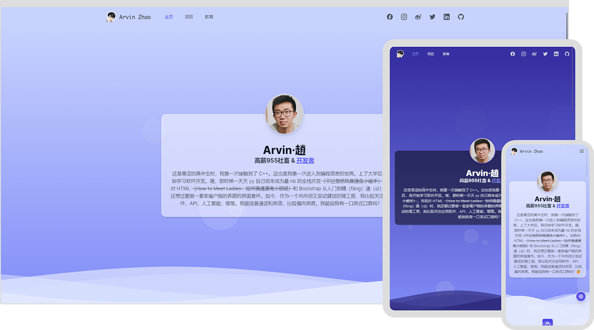

# [isarvin.com](https://isarvin.com)

[](https://www.codacy.com/gh/ArvinZJC/isarvin/dashboard?utm_source=github.com&utm_medium=referral&utm_content=ArvinZJC/isarvin&utm_campaign=Badge_Grade)
[](https://isarvin.com)

[](./LICENCE)

[English (United Kingdom)](./README.md) | **中文（简体，中国）**

> 个人网站的创建让我更了解自己了，所以这就是 Arvin。😉

Arvin 是俺的英文名，作为一个抱大腿的调包开发者，终于在鱼都摸烂了后用 Vue.js 3 和 [Tailwind CSS](https://tailwindcss.com/) 建了此个人网站。网站部署在 [Vercel](https://vercel.com/home) 上。网站的设计遵循以下主要原则。

<details>
  <summary>点我展开/折叠</summary>

- 无障碍：支持减少动画。
- 支持深色模式。
- 国际化。支持的语言如下：
  - English (United Kingdom)
  - English (United States) ——无匹配语言时默认
  - 中文（简体，中国）
- 性能：防抖、节流，等等。
- 响应式布局。
- 统一设计语言。

</details>



## ❗ 注意

> 敲黑板了！敲黑板了！🔥

1. 截至 2022 年 8 月 8 日，使用 Visual Studio Code（版本：1.70.0）、Node.js 16.15.0 和 Vite 3.0.4 开发表现良好。此外，我要特别感谢 Tailwind 提供的[丰富、可扩展的 CSS 框架和资源](https://tailwindcss.com/resources)，这节省了许多开发时间。
2. 受 [Tailwind CSS 的影响](https://tailwindcss.com/docs/browser-support)，网站能支持**大多数主流浏览器的最新稳定版**。

   > Tailwind CSS v3.0 主要是为在 Chrome、Firefox、Edge 和 Safari 的最新稳定版上有良好的表现而设计并测试的。任何版本 IE（包括 IE 11）都不受支持。

3. 项目主要依赖参见下面的表格。更多信息请参见 [`package.json`](./package.json)。

   | 名称                          |      版本      |
   | :---------------------------- | :------------: |
   | @headlessui/vue               |     1.6.7      |
   | @heroicons/vue                |     1.0.6      |
   | @intlify/vite-plugin-vue-i18n |     6.0.0      |
   | autoprefixer                  |     10.4.8     |
   | postcss                       |     8.4.16     |
   | smoothscroll-polyfill         |     0.4.4      |
   | tailwindcss                   |     3.1.8      |
   | vue                           |     3.2.37     |
   | vue-i18n                      |     9.1.10     |
   | vue-meta                      | 3.0.0-alpha.10 |
   | vue-router                    |     4.1.3      |

4. 在项目根目录下，按如下步骤使用 npm 的命令可以在本地运行此项目。

   - 安装项目所需依赖。

     ```sh
     npm ci
     ```

   - 调试与构建。

     - 若调试项目（开发环境），则：

       ```sh
       npm run dev
       # 或
       npx vite --host
       ```

     - 若构建项目（生产环境），则：

       ```sh
       npm run build
       # 或
       npx vite build

       npm run preview
       # 或
       npx vite preview --host --port 5050
       ```

     - _（推荐）_ 若使用 Visual Studio Code 的运行和调试面板, 则需要将下面内容添加至 `.vscode/launch.json` 来配置此项目的调试与构建过程。

       ```JSON
       {
         "configurations": [
           {
             "name": "Dev",
             "request": "launch",
             "runtimeArgs": ["run", "dev"],
             "runtimeExecutable": "npm",
             "skipFiles": ["<node_internals>/**"],
             "type": "node"
           },
           {
             "name": "Build",
             "request": "launch",
             "runtimeArgs": ["run", "build"],
             "runtimeExecutable": "npm",
             "skipFiles": ["<node_internals>/**"],
             "type": "node"
           },
           {
             "name": "Preview",
             "request": "launch",
             "runtimeArgs": ["run", "preview"],
             "runtimeExecutable": "npm",
             "skipFiles": ["<node_internals>/**"],
             "type": "node"
           }
         ]
       }
       ```

好运哦! 💖
